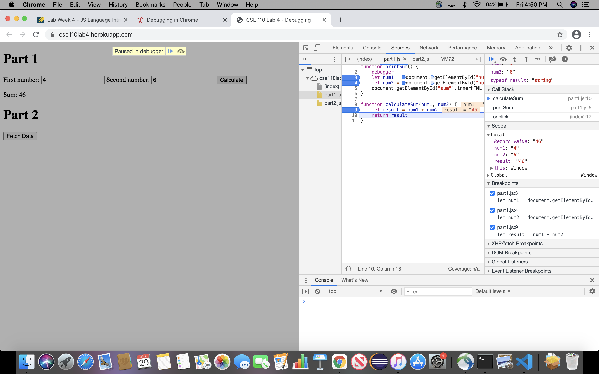
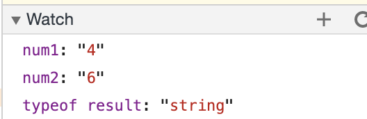
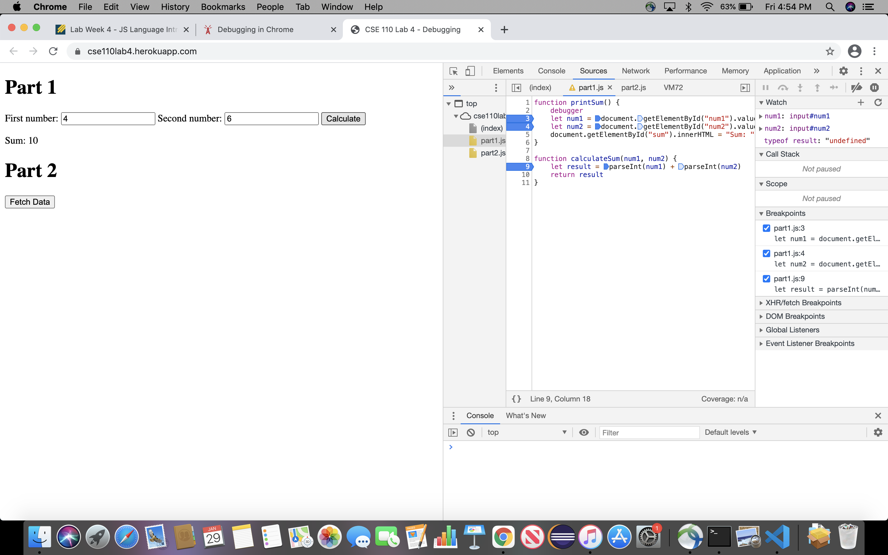

Questions from screenshot debug:
- The bug was that the result being printed was a concatenation of the two strings instead of the actual result of adding them both together. This was because num1 and num2 were being seen as strings instead of ints. 
- The solution was to change the addition on line 9 inside the part1.js from just num1 + num2 to parseInt(num1) + parseInt(num2). This would then chenge the addition from a concatenation of two strings to now an addition of two ints, and would return a number.
- ScreenShots attached:
  - this

